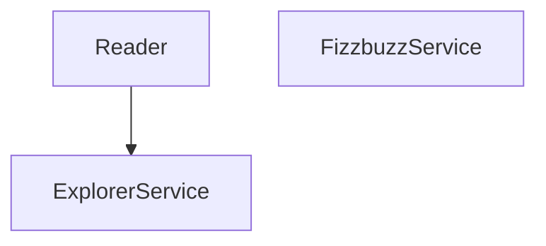
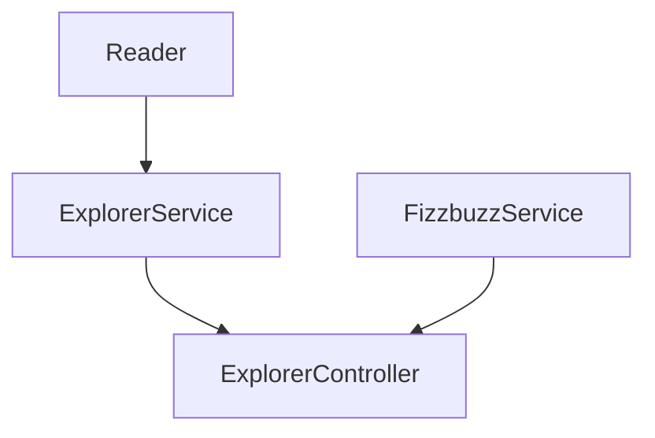
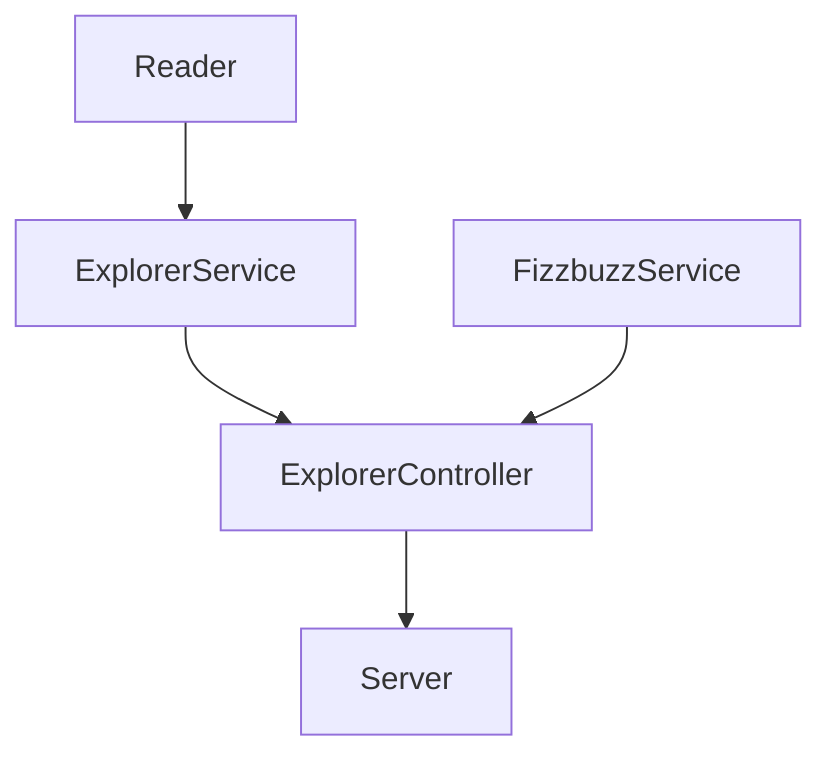
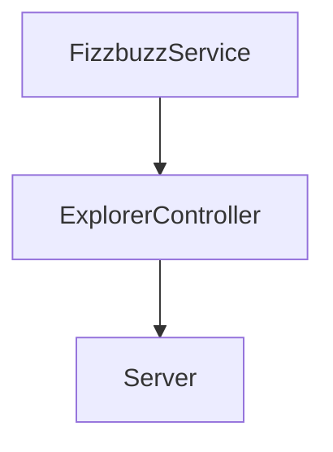

# 💥 Proyecto FIZZBUZZ

✔️ **Requerimientos**

1. Refactorizar el script legado y rehacerlo con mucho cuidado. 
2. Crear un API para usar la funcionalidad anterior:

| Endpoint | Request | Response |
|---|---|---|
| `localhost:3000/v1/explorers/:mission` | `localhost:3000/v1/explorers/node` | Deberás obtener la lista de explorers en la misión que enviaste (node o java) |
| `localhost:3000/v1/explorers/amount/:mission` | `localhost:3000/v1/explorers/amount/node` | Deberás obtener la cantidad de explorers según la misión que enviaste (node o java) |
| `localhost:3000/v1/explorers/usernames/:mission` | `localhost:3000/v1/explorers/usernames/node` | Deberás obtener la lista de usernames en la misión que enviaste (node o java) |

3. Crear un endpoint para recibir un número y aplicar la validación del fizzbuzz. 

## 💫 Parte 1. Refactoring

Este proyecto lee un archivo `explorers.json` que contiene una lista de explorers con información que se necesita procesar. Con este script se logró:

+ Obtener la lista de explorers que solo están en node.
+ Obtener la cantidad de explorers que están en node.
+ Obtener la lista de usuarios de github de los explorers que están en node.
+ Se necesitó crear una validación llamada FizzBuzz, si el explorer tiene un score que sea divisible entre 3 (revisa cómo hacer esto), deberá tener un campo trick que diga FIZZ, cualquier otro caso el valor de este nuevo campo deberá ser el score mismo. Esta validación nos sirve porque necesitamos aplicarla a la lista de todos los explorers y saber cuáles son FIZZ.
+ Después necesitamos una validación muy similar pero para cuando el score sea divisible entre 5, entonces el valor del nuevo campo trick será BUZZ, cualquier otro caso el valor será el score.
+ Pero después volvimos a necesitar otro caso para cuando el valor del score fuera divisible entre 3 y también entre 5, entonces el valor del campo trick debe ser FIZZBUZZ, de lo contrario tendrá el valor del score.

Actualmente las últimas 3 validaciones se corren independientemente. Se necesita una misma validación que apliqué las tres reglas a toda la lista:

+ Si el campo score del explorer es divisible entre 3, entonces se agrega un campo nuevo llamado trick cuyo valor será FIZZ.
+ Si el campo score del explorer es divisible entre 5, entonces se agrega un campo nuevo llamado trick cuyo valor será BUZZ.
+ Si el campo score del explorer es divisible entre 3 y 5, entonces se agrega un campo nuevo llamado trick cuyo valor será FIZZBUZZ.
+ Si el campo score no es divisible por ninguna de las reglas anteriores, se agrega un campo nuevo llamado trick cuyo valor será el del score.

### 📌 Scripts

📁 Carpeta `lib/utils`: Aquí se tiene una clase para leer un archivo json. Refactorización de la lectura del archivo.

**Script**: [`Reader.js`](https://github.com/DanielaBeltranCruz/FizzBuzz/blob/master/lib/utils/Reader.js)

📁 Carpeta `lib/services`: Aquí se tienen dos clases para realizar toda la lógica que se necesita.

**Script**: [`ExplorerService.js`](https://github.com/DanielaBeltranCruz/FizzBuzz/blob/master/lib/services/ExplorerService.js)

**Script**: [`FizzbuzzService.js`](https://github.com/DanielaBeltranCruz/FizzBuzz/blob/master/lib/services/FizzbuzzService.js)

📁 Carpeta `test/services`: Aquí se tiene una prueba.

**Script**: [`ExplorerService.test.js`](https://github.com/DanielaBeltranCruz/FizzBuzz/blob/master/test/services/ExplorerService.test.js)

#### 📎 Referencia 

Enlace: [1_refactoring_fizzbuzz_parte1.md](https://github.com/LaunchX-InnovaccionVirtual/MissionNodeJS/blob/main/semanas/semana_4/1_refactoring_fizzbuzz_parte1.md "1_refactoring_fizzbuzz_parte1.md")

## 💫 Parte 2. API con Express

Estas son las clases que se tienen hasta ahora que permiten implementar la lógica legada anteriomente:

Ahora se necesita crear otra clase que permita extender un puente entre funcionalidad y el server que se va a crear:

Para que en el server que será el API solo se comuniqué a partir de ahí:

Para lograr lo anterior, se creó una carpeta nueva llamada `controllers` con un script llamado `ExplorerController.js`, cuya función es conectar la funcionalidad con el server.

Posteriormente, se creó el server usando Express y un script llamado `server.js`, en dicho script se encuentra el código correspondiente al levantamiento del servidor así como de los endpoints requeridos para regresar información.

### 📌 Scripts

📁 Carpeta `lib/controllers`: Aquí se tiene una clase para conectar la funcionalidad con el server.

**Script**: [`ExplorerController.js`](https://github.com/DanielaBeltranCruz/FizzBuzz/blob/master/lib/controllers/ExplorerController.js)

📁 Carpeta `lib`: Aquí se tiene el código del server.

**Script**: [`server.js`](https://github.com/DanielaBeltranCruz/FizzBuzz/blob/master/lib/server.js)

### 📍 Endpoints

1. Endpoint para recibir un parámetro por query params, y regresar la lista de explorers filtrados por el parámetro: 

2. Endpoint para regresar la cantidad de explorers según la misión que se envíe:

3. Endpoint para regresar la lista de usernames de los explorers filtrados por la misión:

#### 📎 Referencia 

Enlace: [2_api_fizzbuzz_parte2.md](https://github.com/LaunchX-InnovaccionVirtual/MissionNodeJS/blob/main/semanas/semana_4/2_api_fizzbuzz_parte2.md)

## 💫 Parte 3. Nuevo requerimiento: Crear un endpoint para recibir un número y aplicar la validación del fizzbuzz

| Endpoint | Request | Response |
|---|---|---|
| `localhost:3000/v1/fizzbuzz/:score` | `localhost:3000/v1/fizzbuzz/1` | `{score: 1, trick: 1}` |
| `localhost:3000/v1/fizzbuzz/:score` | `localhost:3000/v1/fizzbuzz/3` | `{score: 3, trick: "Fizzz"}` |
| `localhost:3000/v1/fizzbuzz/:score` | `localhost:3000/v1/fizzbuzz/5` | `{score: 5, trick: "Buzz"}` |
| `localhost:3000/v1/fizzbuzz/:score` | `localhost:3000/v1/fizzbuzz/15` | `{score: 15, trick: "Fizzbuzz"}` |

### Diseño actual

### Flujo de Nueva funcionalidad

**Solución**

Se creó la nueva funcionalidad dentro de FizzbuzzService, misma que es usada en el ExplorerController y de ahí es implementada en el server.

#### 📎 Referencia 

Enlace: [3_nuevo_feature_fizzbuzz_parte3.md](https://github.com/LaunchX-InnovaccionVirtual/MissionNodeJS/blob/main/semanas/semana_4/3_nuevo_feature_fizzbuzz_parte3.md)

